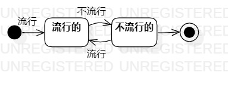

# 实验7：状态建模

## 一、实验目标

1. 掌握对象状态建模（状态图，Statechart）

## 二、实验内容

1. 分析系统，确定所涉及的系统对象
2. 在状态图上画出对象的所有状态
3. 在状态图上画出状态的变化条件

## 三、实验步骤

1. 分析系统提炼出关键对象
2. 分析用例图、类图、流程图提炼出对象所有的状态
3. 在StarUML画出各个状态
4. 分析活动图，找出各状态之间变换的条件
5. 建立各个参与者之间的变换关系（任务的状态图）

## 四、实验结果

​										乐器的状态图