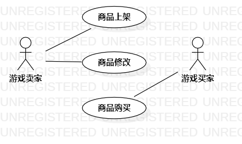

# 实验二

## 一、实验目标
- 理解什么叫做用例
- 使用StarUML对用例进行建模
## 二、实验内容
- 对自己所选的用例进行建模
## 三、实验步骤
- 创建两个Actor：游戏卖家，游戏买家
- 创建三个Use Case：商品上架、商品购买、商品修改
- 链接买家和卖家的Use Case
## 四、实验结果

实验二用例图

## 表1.上架游戏用例规约
用例编号 | 01 | 备注
---|---|---
用例名称 | 上架游戏 |
前置条件 |  |可选
后置条件 | 跳转至商城主页面 |可选
基本流程 | 1. 卖家点击上架游戏链接； |用例执行成功的步骤
 | |2. 系统跳转至上架游戏页面
 | |3. 卖家输入游戏信息，点击提交按钮；
 | |4. 系统审核游戏内容并保存游戏内容；
 | |5. 系统提示上架游戏成功。
 扩展流程| 4.1 游戏内容与描述不符 ；|用例执行失败
 | |4.2 游戏内容不符合国家法律法规
 
 ## 表2.修改游戏内容用例规约
用例编号 | 02 | 备注
---|---|---
用例名称 | 修改游戏内容 |
前置条件 |  |可选
后置条件 |  |可选
基本流程 | 1. 卖家点击修改链接； |用例执行成功的步骤
 | |2. 系统跳转修改页面；
 | |3. 卖家输入修改过后的内容，点击修改按钮；
 | |4. 系统审核游戏内容并保存修改后的游戏内容；
 | |5. 系统提示修改成功。
 扩展流程| 4.1 修改的内容不符法律法规 |用例执行失败
 
  ## 表3.购买游戏用例规约
用例编号 | 03 | 备注
---|---|---
用例名称 | 购买游戏 |
前置条件 | 买家尚未拥有该游戏 |可选
后置条件 |  |可选
基本流程 | 1. 买家点击购买链接； |用例执行成功的步骤
 | |2. 系统跳转购买页面；
 | |3. 买家向卖家支付所需金额；
 | |4. 系统确认转账记录，并修改买家账户游戏所有权；
 | |5. 系统提示买家购买成功，提醒卖家出售成功。
 扩展流程| 3.1 买家支付失败 |用例执行失败

