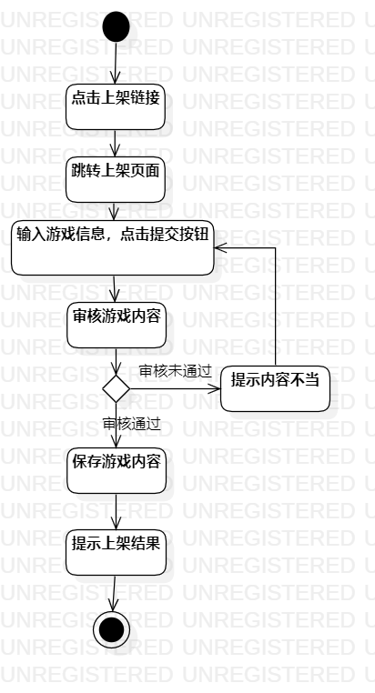
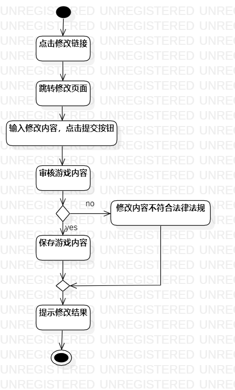
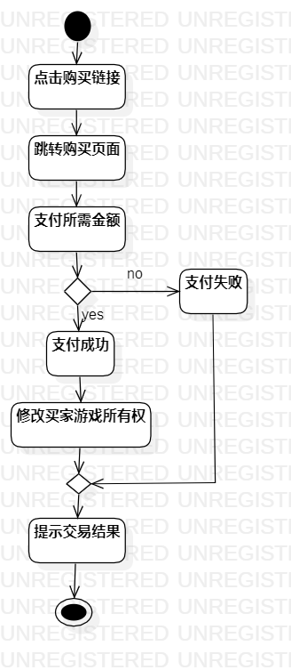

# 实验三

## 实验目标
1. 掌握过程建模方法；
2. 掌握活动图的画法。（Activity Diagram）
## 实验步骤
1. 创建开始(Initial)和结束(Final)节点；
2. 创建操作（Action）模块；
3. 创建决策(Decision)节点；
4. 将模块和节点用箭头连起。
## 画图要点
1. 把基本流程和扩展流程的动作画为操作（Action）；
2. 在出现分支的操作之后使用决策（Decision）节点。
## 实验结果

上架游戏过程图
修改游戏内容过程图
购买游戏内容图
