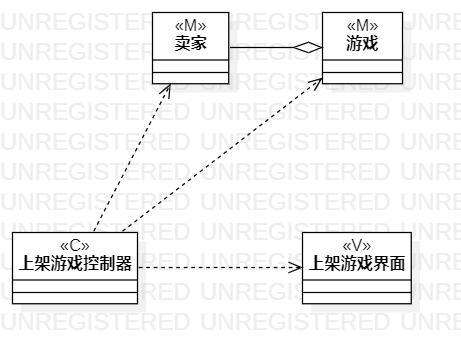
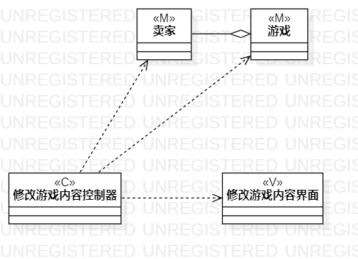
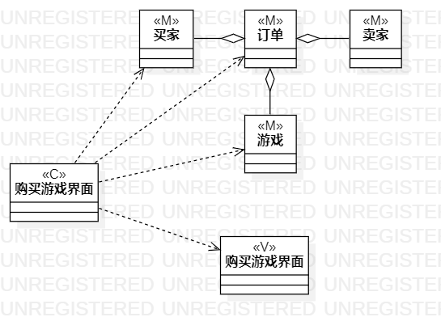

# 实验目标
1. 掌握类建模方法；
2. 了解MVC或你熟悉的设计模式；
3. 掌握类图的画法。（Class Diagram）
# 实验内容
1. 基于MVC模式设计类；
2. 设计类的关系；
3. 画出类图。
# 实验步骤
1. 创建类的模型（MODEL）；
2. 创建类的视图(VIEW)；
3. 创建类的控制器（CONTRIL）；
4. 将控制器用依赖关系链接模型及视图。
# 实验结果
上架游戏类图
修改游戏类图
购买游戏类图
