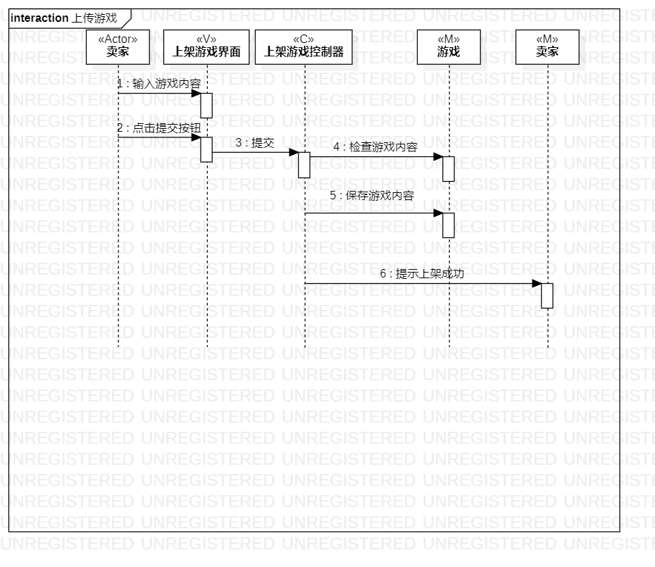
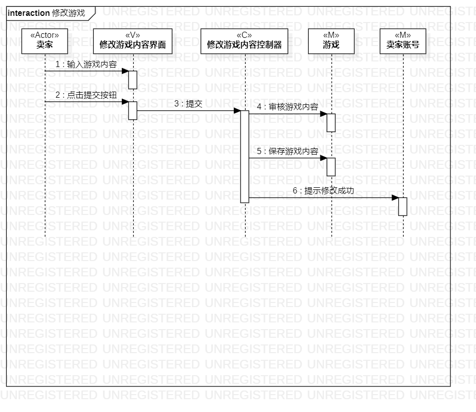
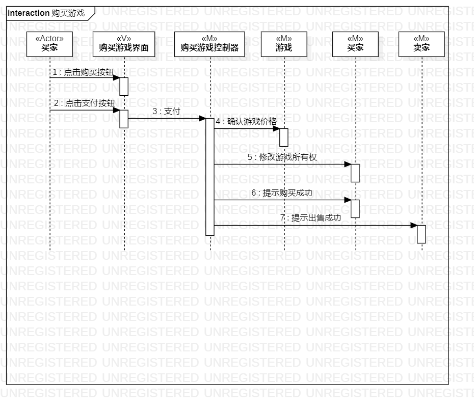

# 实验目标
1. 理解系统交互；
2. 掌握UML顺序图的画法；
3. 掌握对象交互的定义与建模方法。
# 实验内容
1. 根据用例模型和类模型，确定功能所涉及的系统对象；
2. 在顺序图上画出参与者（对象）；
3. 在顺序图上画出消息（交互）。
# 实验步骤
1. 对照活动图，创建参与者
2. 对照活动图，画图参与者之间的消息
3. 修改并核对之前实验内容与此次实验内容
# 实验结果
上架游戏对象图
修改游戏内容对象图
购买游戏对象图
