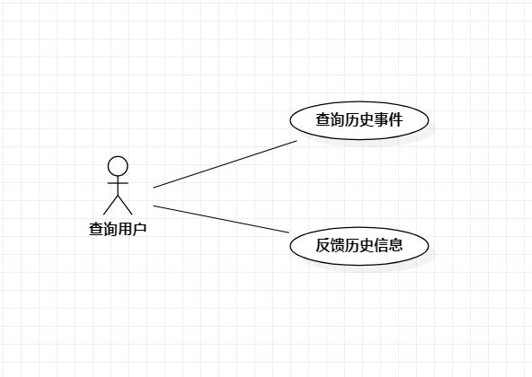

# 实验二：用例建模

## 一、实验目标

1. 使用Markdown编写报告
2. 细化选题
3. 学习使用StarUML用例建模

## 二、实验内容

1. 创建用例图
2. 编写实验报告文档
3. 编写用例规约

## 三、实验步骤

1. 选题为历史事件查阅系统
2. 根据issues在StarUML上创建用例图
3. 确定参与者（Actor）：
   - 查询用户 
4. 确定用例（UserCase）
   - 查询历史事件
   - 反馈历史信息
5. 建立Actor和USerCase之间的联系
6. 绘制用例图
7. 编写用例规约

## 四、实验结果

图1：历史查询用例图

## 表1：查询历史事件用例规约  

| 用例编号 | UC01                                                         | 备注                 |
| -------- | :----------------------------------------------------------- | -------------------- |
| 用例名称 | 查询历史事件                                                 |                      |
| 前置条件 | 用户进入查询系统                                             | *可选*               |
| 后置条件 |                                                              | *可选*               |
| 基本流程 | 1. 用户点击进入查询系统按钮；                                | *用例执行成功的步骤* |
| ~        | 2. 系统显示查询系统页面；                                    |                      |
| ~        | 3. 用户输入查询的日期；                                      |                      |
| ~        | 4. 系统检查当前用户输入日期不为空，查询历史信息，提示“查询成功”； |                      |
| ~        | 5. 系统显示历史事件页面。                                    |                      |
| 扩展流程 | 4.1 系统检查当前输入日期为空，提示“查询内容不能为空”         | *用例执行失败*       |

## 表2：反馈历史信息用例规约  

| 用例编号 | UC02                                                         | 备注                 |
| -------- | :----------------------------------------------------------- | -------------------- |
| 用例名称 | 反馈历史信息                                                 |                      |
| 前置条件 | 用户进入反馈系统                                             | *可选*               |
| 后置条件 |                                                              | *可选*               |
| 基本流程 | 1. 用户点击进入反馈系统按钮；                                | *用例执行成功的步骤* |
| ~        | 2. 系统显示反馈系统页面；                                    |                      |
| ~        | 3. 用户输入日期，及日期对应历史事件的反馈信息；              |                      |
| ~        | 4. 系统检测用户输入反馈内容不为空，系统保存反馈内容，并提示“反馈成功”； |                      |
| ~        | 5. 系统显示历史事件页面。                                    |                      |
| 扩展流程 | 4.1 系统检测用户输入反馈内容为空，提示“反馈内容不能为空”；   | *用例执行失败*       |