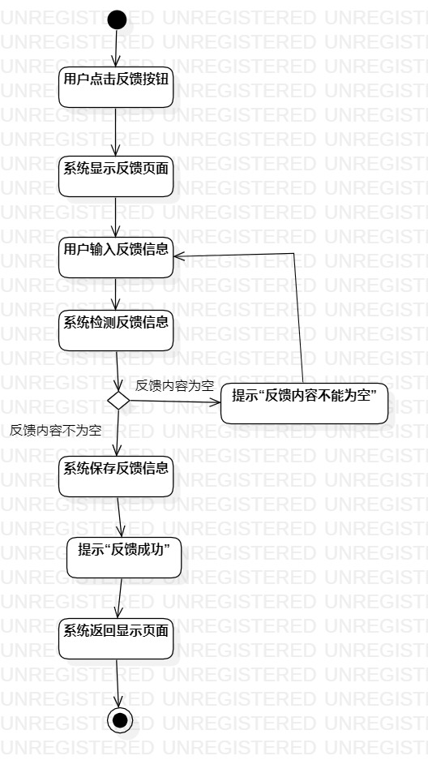

# 实验三   过程建模
## 一、实验目标

1. 掌握过程建模方法；
2. 掌握活动图的画法。（Activity Diagram）

## 二、实验内容
1. 观看实验3相关视频；  
2. 用Markdown完成实验报告；  
3. 用StarUML完成活动图。  

## 三、实验步骤  
1.在StarUML创建两个活动图：  
（1）查询历史事件；  
（2）反馈历史信息。  
2.添加Initial和Final节点；  
3.根据用例规约画出活动图：  
（1）把基本流程和扩展流程的动作画为操作（Action）；  
（2）分支的操作之后使用决策（Decision）节点。  
## 四、实验结果

  
图1 查询历史事件活动图

  
图2 反馈历史信息活动图