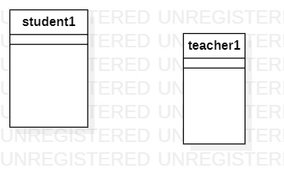

# 实验一 UML建模工具

## 1 实验目的
1.1 学会github的基本使用  
1.2 学会安装和使用建模工具  
## 2 实验内容
2.1 安装github并练习使用Git Bash  
2.2 安装startUML并创建一个图  
## 3 实验步骤  
3.1 查看视频，学习 github和startUML的使用方法  
3.2 创建lab1.md实验报告并完善内容  
3.3 创建第一个startUML图  
## 4 实验结果

