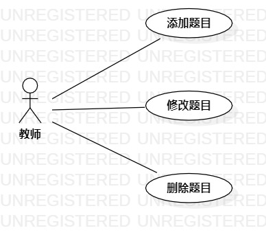

# 实验二 用例建模

## 1 实验目的
1.1 加强github的使用   
1.2 掌握画用例图  
1.2 掌握如何编写用例规约    
## 2 实验内容   
2.1 创建用例图  
2.2 编写用例规约
## 3 实验步骤
3.1  首先在issue里提交自己的选题和功能介绍  
3.2 我的题目是#573 题库系统    
3.3  创建用例图      
（1）确认参与者：老师  
（2）添加用例：添加题目，修改题目       
（3）建立参与者与用例的联系       
3.4 编写用例规约   
（1）编写添加题目用例规约    
（2）编写修改题目用例规约    
## 4 实验结果  
  
 图1：题库用例图1      

## 表1：修改题目用例规约  

用例编号  | UC01 | 备注  
-|:-|-  
用例名称  | 修改题目  |   
前置条件  |      | *可选*   
后置条件  |      | *可选*   
基本流程  | 1.老师点击修改题目按钮  |*用例执行成功的步骤*    
~| 2.系统显示修改题目页面  |
~| 3.老师输入题目信息，点击“修改”按钮    |
~| 4.系统检测输入的题目信息不为空，系统更新题目的信息后，提示“修改成功”  |
~| 5.系统跳转到题目页面  |
扩展流程  | 4.1 系统检查题目输入的内容为空，提示“题目输入内容不能为空” |*用例执行失败*    
 
## 表2：添加题目用例规约  

用例编号  | UC02 | 备注  
-|:-|-  
用例名称  |添加题目 |   
前置条件  |      | *可选*   
后置条件  |      | *可选*   
基本流程  |1.老师点击添加题目按钮 |*用例执行成功的步骤*    
~| 2.系统显示添加题目页面 |
~| 3. 老师输入题目的内容 |
~| 4. 系统检测输入的内容不为空，保存题目信息后，提示“题目添加成功”  |
~| 5.  系统跳转到题目页面  |  
扩展流程  | 4.1  系统检测题目输入的内容为空 ，提示“题目内容不为空”|*用例执行失败*    
 
