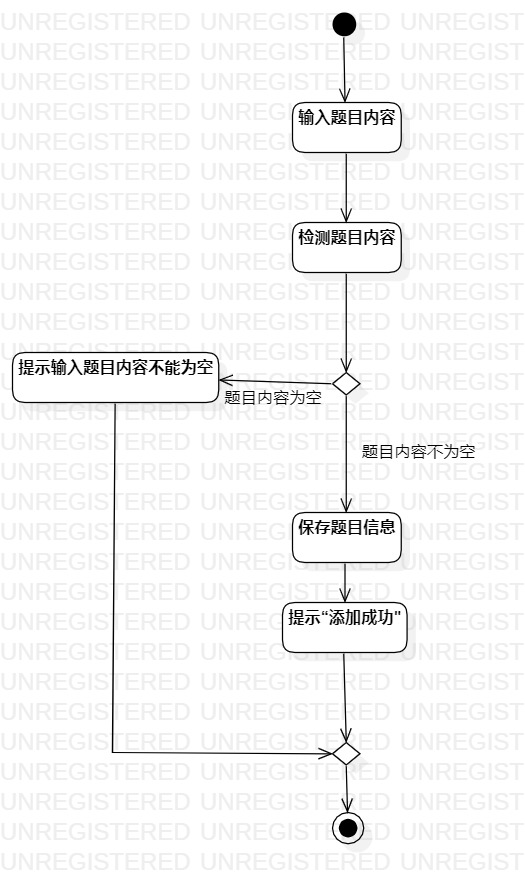
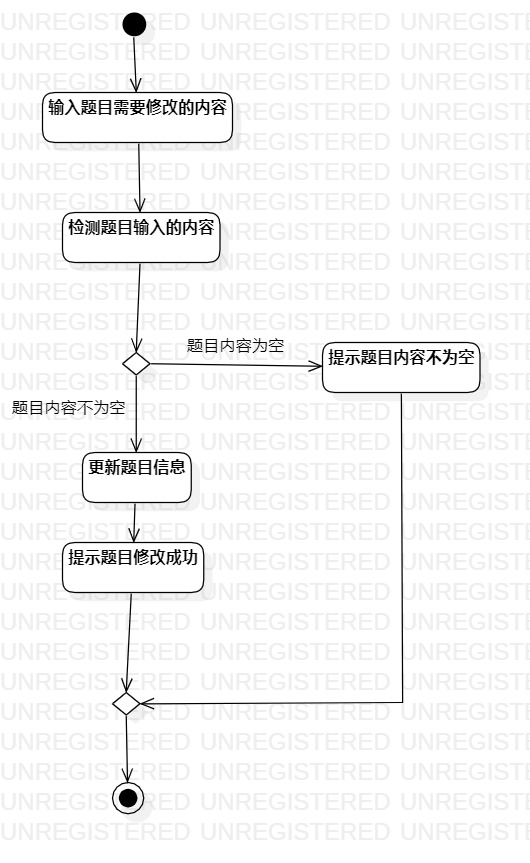

# 实验三：过程建模

## 一：实验目标  
1. 理解活动用例元素  
2. 掌握过程建模方法  
3. 掌握活动图（Activity Diagram）的画法  

## 二、实验内容  
1. 学习活动图的概念和组成  
2. 根据lab2中编写的用例规约画活动图  

## 三、实验步骤  
1. 观看教学视频  
2. 根据用例规约来画活动图   
3. 将绘制的活动图导出为图片
4. 编写Lab3实验报告

## 四、实验结果

### 项目活动图  
  
图1：添加题目的活动图  

  
图2：修改题目的活动图  
