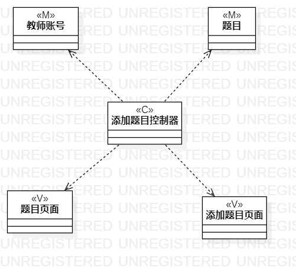
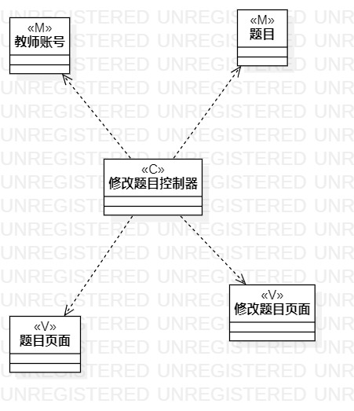

# 实验四:类建模  
# 实验五:高级类建模  

## 一、实验目标
- 掌握类的概念和构成  
- 掌握类建模方法  
- 了解MVC或者熟悉的设计模式  
- 理解类的5种关系  
- 掌握类之间关系的画法  

## 二、实验内容
- 基于MVC模式设计类  
- 设计类的关系  
- 根据用例规约绘制相应的类图。    
    1.修改题目类图  
    2.添加题目类图  
 
- 从用例规约中的基本流程和扩展流程中确定数据、界面、控制器  
- 根据系统操作设计业务控制类  
- 根据MVC设计模式确定类的关系  
 ## 四、实验结果   
     
图1 添加题目类图  

    
图1 添加题目类图 
