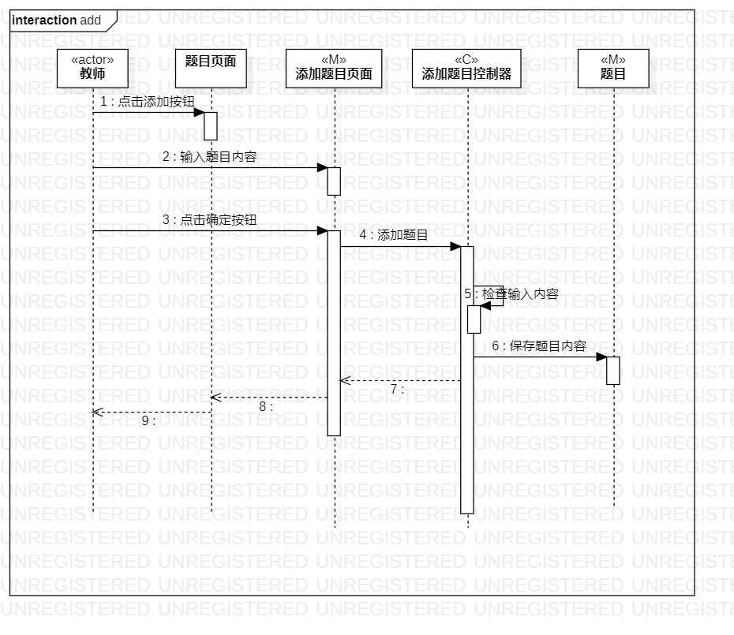
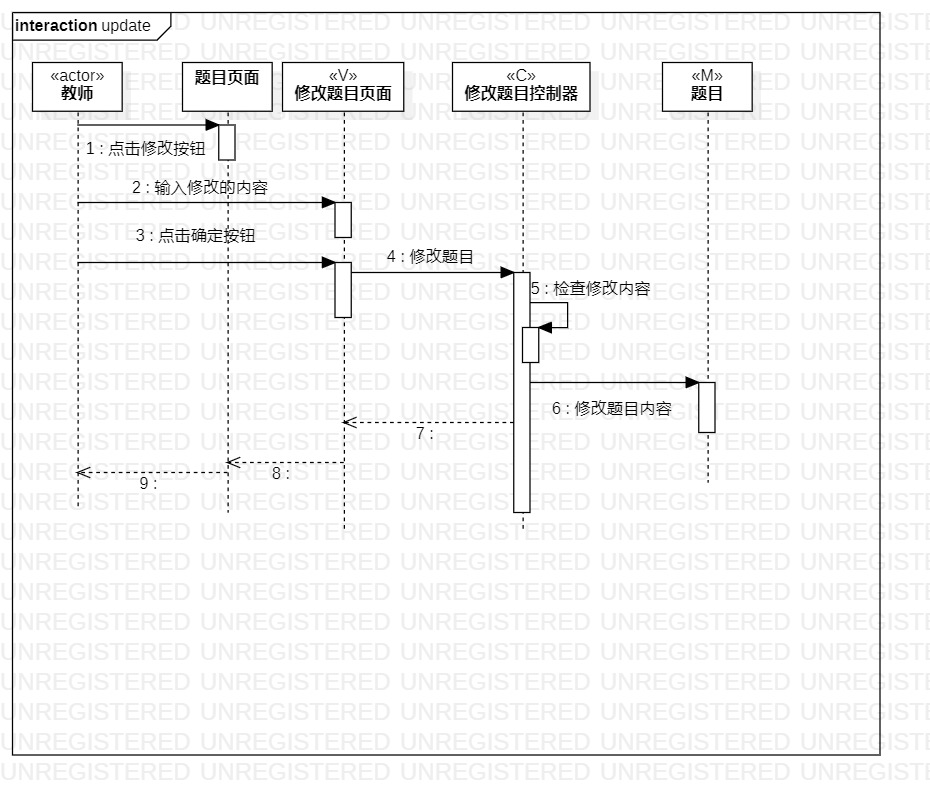

# 实验六: 交互建模
## 一、实验目标
- 理解系统交互；
- 了解对象的概念
- 掌握UML顺序图的画法；
- 掌握对象交互的定义与建模方法。
## 二、实验内容
- 根据用例模型和类模型，确定功能所涉及的系统对象；

   1.添加题目顺序图

   2.修改题目顺序图
 

- 在顺序图上画出参与者；

- 在顺序图上画出消息

- 在顺序图上画出存活条

- 在顺序图上画出时间  

## 三、实验步骤
- 在StarUml中创建顺序图

- 从用例规约中的寻找参与者和根据类图中寻找类，添加Lifeline 

- 根据活动图绘制消息，添加message

- 根据用例建模，过程建模确定返回消息，添加Reply Message  

## 四、实验结果
  
图1：添加题目的活动图  

  
图2：修改题目的活动图  
 

