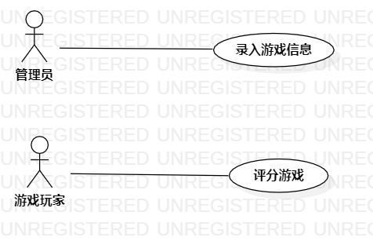

# 实验二：用例建模

## 一、实验目标

1.在issue上创建题目

2.会使用StarUML画图

## 二、实验内容

1.想一个题目和需要实现的功能

2.将题目创建在issue上

3.使用StarUML画一个图

4.画用例表

## 三、实验步骤

1.在issue上创建PC游戏评分系统题目

2.确定参与者和用例

参与者：（1）评分系统管理员 （2）游戏玩家

用例： （1）录入游戏信息 （2）评分游戏

3.根据关系在UML上画图（Lab2_UseCaseDiagram）

4.根据关系画用例表

## 四、实验结果

图1.PC游戏评分系统的用例图

## 表1：录入游戏信息用例规约

用例编号  |UC01| 备注
-|:-|-
用例名称  | 录入游戏信息 |
前置条件  |  评分系统管理员已登录管理员账号 | *可选*
后置条件  |     | *可选*
基本流程  |  1.管理员点击“录入信息”按钮；  | *用例执行成功的步骤*
~|  2.系统显示输入游戏信息界面；  |
~|  3.管理员输入游戏信息，点击“录入”按钮；  |
~|  4.系统确定游戏信息完整填写，保存管理员上传的游戏信息。  |
扩展流程  |  4.1系统检查发现未完整填写信息，提示“请完整填写游戏信息”；  | *用例执行失败*

## 表2：评分和评论游戏用例规约

用例编号  |UC02| 备注
-|:-|-
用例名称  | 评分和评论游戏 |
前置条件  |  游戏玩家已登录玩家账号 | *可选*
后置条件  |     | *可选*
基本流程  |  1.游戏玩家点击“评分和评论”按钮；  | *用例执行成功的步骤*
~|  2.系统显示输入评分以及评论界面；  |
~|  3.游戏玩家输入游戏；   |
~|  4.系统确定游戏存在；   |
~|  5.游戏玩家输入评分以及评论，点击“确定”按钮；  |
~|  6.系统确定评分和评论完整填写，保存游戏玩家的评分和评论。  |
扩展流程  |  4.1系统检查游戏不存在，提示“游戏不存在”；  |  *用例执行失败*  
~|  6.1系统检查发现未完整填写评分和评论，提示“请完整填写评分以及评论”；  | 
       
