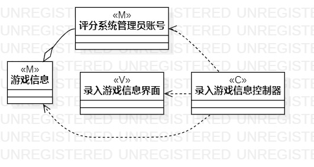
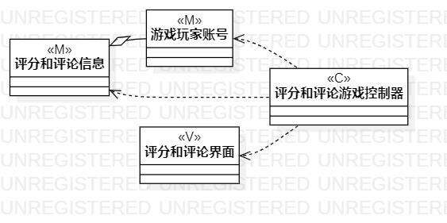

# 实验四、五：类建模和高级类建模

## 一、实验目标

1. 掌握类建模方法；
2. 了解MVC或熟悉的设计模式；
3. 掌握类图的画法；（Class Diagram）
4. 理解类的5种关系；
5. 掌握类之间关系的画法。（Class Diagram）

## 二、实验内容

1. 学习类图概念；
2. 学习类图画法；
3. 根据实验二中的用例规约创建类图。

## 三、实验步骤

1. 创建录入游戏信息的类图；
2. 创建四个类，分别是评分系统管理员账号、录入游戏信息控制器、游戏信息和录入游戏信息信息界面；
3. 然后给录入游戏信息控制器、游戏信息、录入游戏信息界面和评分系统管理员账号添加依赖关系（Dependency）；
4. 给评分系统管理员账号和游戏信息添加聚合关系（Aggregation）； 
5. 创建评分游戏的类图；
6. 创建四个类，分别是游戏玩家账号、评分和评论游戏控制器、评分和评论信息及评分和评论界面；
7. 然后给评分和评论游戏控制器、评分和评论信息、评分和评论界面和游戏玩家账号添加依赖关系（Dependency）；
8. 给游戏玩家账号及评分和评论信息添加聚合关系（Aggregation）。 

## 实验结果

   
图1：录入游戏信息的类图

   
图2：评分游戏的类图
