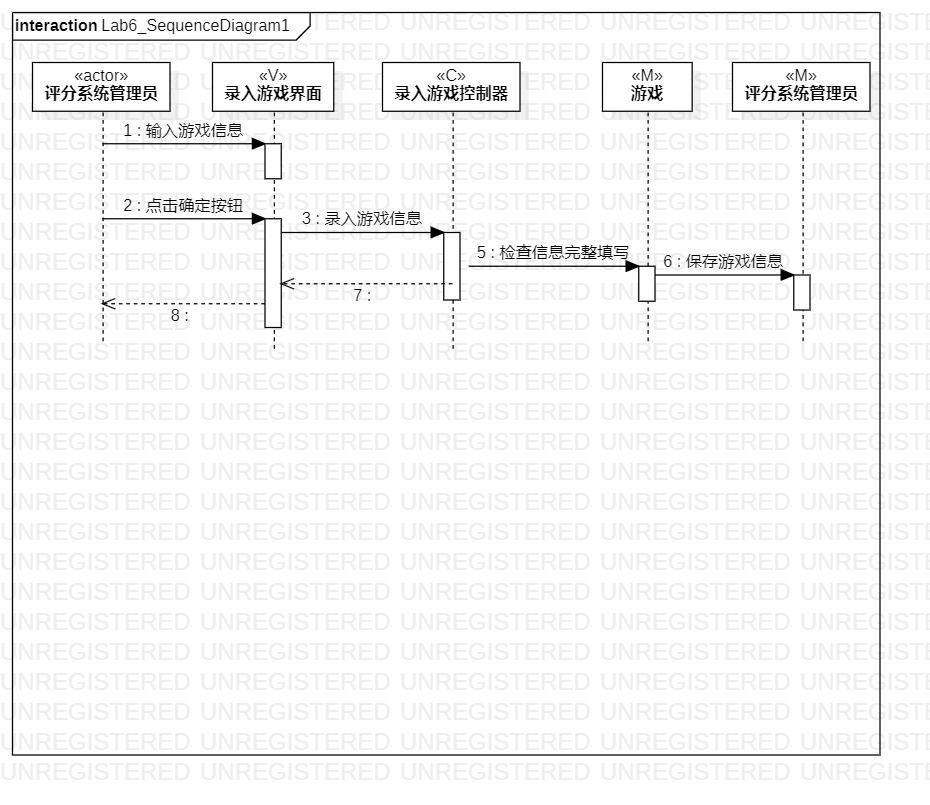
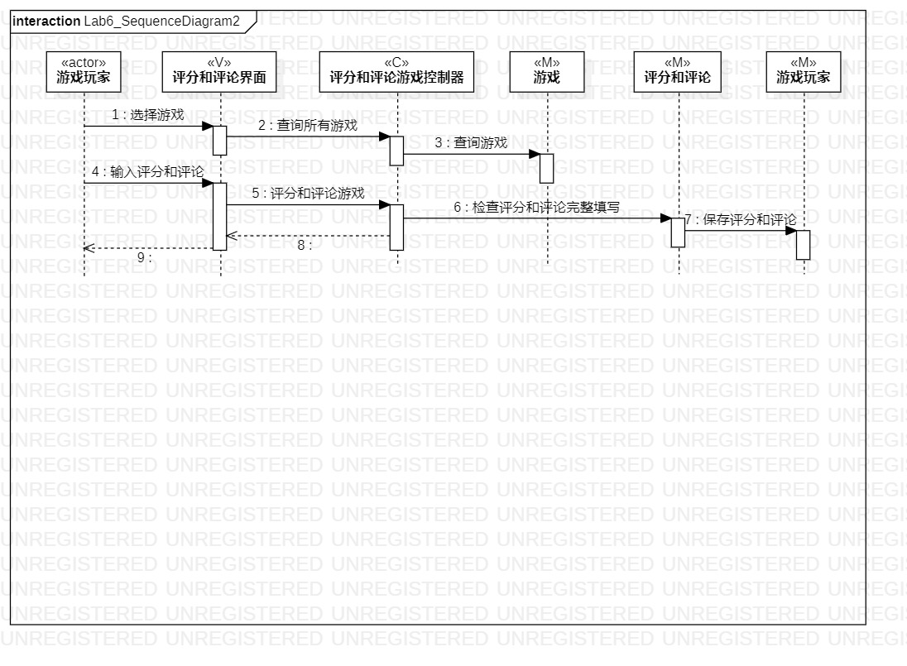

# 实验六：交互建模
## 一、实验目标
1. 理解系统交互；
2. 掌握UML顺序图的画法；
3. 掌握对象交互的定义与建模方法。

## 二、实验步骤
1. 从用例图中找到参与者  
2. 从类图中找到其他N个参与者（N+1）  
3. 从活动图中找到操作步骤  
4. 按时间顺序（从上到下）画出参与者之间的消息

## 三、实验结果
  
图1：录入游戏信息的顺序图  
  
图2：评分和评论游戏的顺序图

