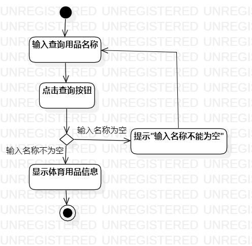
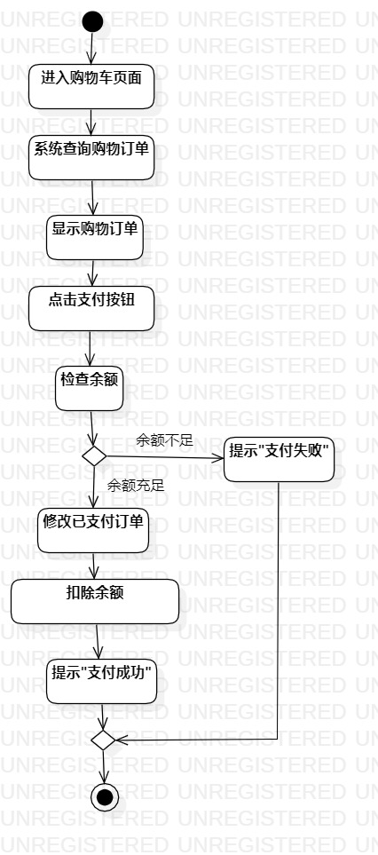

# 实验三：过程建模

 ## 一、实验目标
1. 掌握过程建模方法；
2. 掌握活动图的画法。（Activity Diagram）
## 二、实验内容
1. 使用StarUML根据lab2中编写的用例规约画活动图
## 三、实验步骤
1. 新建活动图（Add Diagram -> Activity Diagram）
2. 使用Activities(Basic)中的元素绘制用例活动图
3. 将绘制的活动图导出为.jpg图片
## 四、实验结果
  
图1：查询体育用品的活动图

  
图2：购买体育用品的活动图

