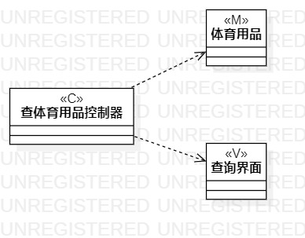
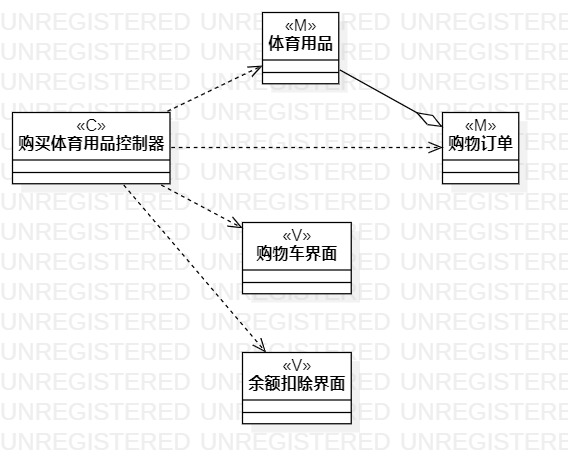

# 实验四五：类建模

## 一、 实验目标  

1. 掌握类建模方法；
2. 了解MVC或你熟悉的设计模式；
3. 掌握类图的画法。（Class Diagram）

## 二、 实验内容  

1. 绘制类图
2. 修改类图
3. 编写实验报告

## 三、 实验步骤  

1. 观看教学视频
2. 绘制类图
3. 观看问题讲解修改类图
4. 编写实验报告

## 四、 实验结果  

 
 

