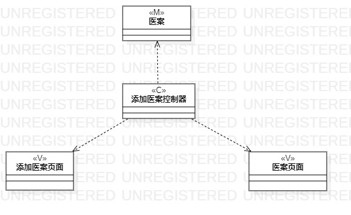
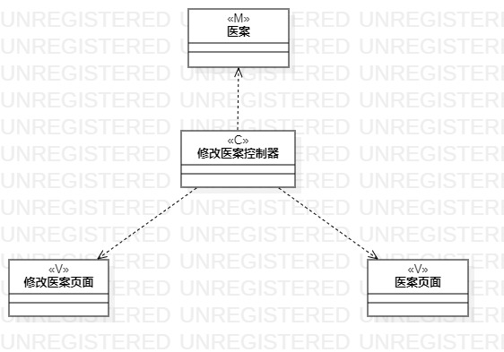

# 实验四&五：类建模与高级类建模

## 一、实验目标

- 掌握类建模方法；

- 了解MVC设计模式；

- 掌握类的五种关系；

- 掌握类图的画法。

## 二、实验内容

- 基于MVC模式设计类；

- 设计类的关系；

- 画出类图。

## 三、实验步骤

- 观看教学视频；

- 依照教学视频以及用例规约寻找类；

- 录入医案用例规约中的类；

  Model：医生、医案
  
  View：添加医案页面、医案页面
  
  Control：添加医案控制器
  
- 修改医案用例规约中的类；

  Model：医生、医案
  
  View：修改医案页面、医案页面
  
  Control：修改医案控制器

- 完成类图的设计；

- 撰写实验报告。

## 四、实验结果
  
图1：录入医案类图

  
图2：修改医案类图
