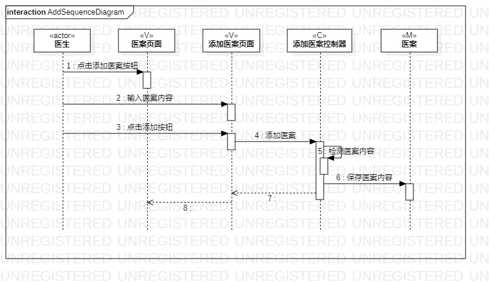
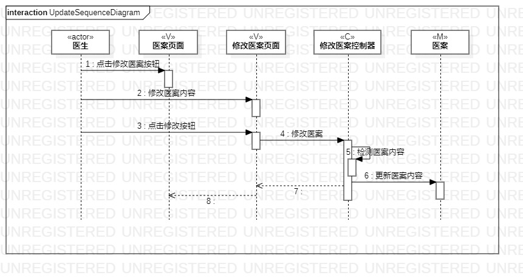

# 实验六：交互建模

## 一、实验目标

- 理解系统交互；

- 掌握UML顺序图的画法；

- 掌握对象交互的定义与建模方法；

## 二、实验内容

- 根据用例模型和类模型，确定功能所涉及的系统对象；

- 在顺序图上画出参与者(对象)；

- 在顺序图上画出消息(交互)。

## 三、实验步骤

- 观看教学视频；

- 依照教学视频以及活动图完成交互建模；

- 确定actor:医生；

- 录入医案活动图中的MVC；

  Model：医案
  
  View：添加医案页面、医案页面
  
  Control：添加医案控制器
  
- 修改医案活动图中的MVC；

  Model：医案
  
  View：修改医案页面、医案页面
  
  Control：修改医案控制器

- 完成交互建模图的设计；

- 撰写实验报告。

## 四、实验结果
  
图1：录入医案顺序图

  
图2：修改医案顺序图
