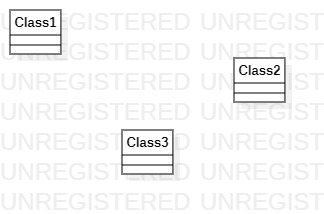

# 实验一

## 实验目标
### 1. 学会github的基本使用  
### 2. 学会安装和使用建模工具 
## 实验内容
### 1. 安装运行GitBash并完成本地创库
### 2. 运行StarUML完成第一次作图
## 实验步骤
### 1. 查看视频，学习 github和startUML的使用方法  
### 2. 创建lab1.md实验报告并完善内容  
### 3. 创建第一个startUML图 
## 实验结果

  
