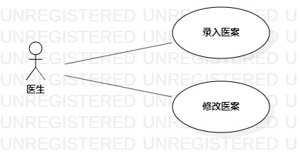

# 实验二：用例建模

## 1. 实验目标

- 掌握用例概念
- 学会用StarUML画用例图

## 2. 实验内容

- 提交选题及说明功能
- 画出选题相关的用例图
- 使用用例规约说明用例

## 3. 实验步骤

- 确认选题：中医医案管理库
- 在Github的issue中说明选题的功能需求
- 创建用例图
- 确认参与者：医生
- 添加用例：录入医案、修改医案
- 建立参与者与用例的联系
- 编写用例规约

## 4. 实验结果

图1：中医医案管理系统的用例图

## 表1：录入医案用例规约  

用例编号  | UC01 | 备注  
-|:-|-  
用例名称  | 录入医案  |   
前置条件  |      | *可选*   
后置条件  |      | *可选*   
基本流程  | 1. 医生点击添加医案按钮；  |*用例执行成功的步骤*    
~| 2. 系统显示添加医案页面；  |   
~| 3. 医生输入医案内容，点击“添加”按钮；  |   
~| 4. 系统检测医案内容不为空，保存医案信息后，提示“医案添加成功”；  |   
~| 5. 系统显示医案页面。  |  
扩展流程  | 4.1 系统检测医案的内容为空，提示“医案内容不能为空”；  |*用例执行失败*    

## 表2：修改医案用例规约

用例编号  | UC02 | 备注
-|:-|-
用例名称  | 修改医案  |
前置条件  |      | *可选*   
后置条件  |      | *可选*   
基本流程  | 1. 医生点击修改医案按钮；  |*用例执行成功的步骤*    
~| 2. 系统显示修改医案页面；  |   
~| 3. 医生修改医案内容，点击“保存修改”按钮；  |   
~| 4. 系统检测医案内容不为空，更新医案内容后，提示“医案修改成功”；  |   
~| 5. 系统显示医案页面。  |  
扩展流程  | 4.1 系统检测医案内容为空，提示“医案内容不能为空”；  |*用例执行失败*    

