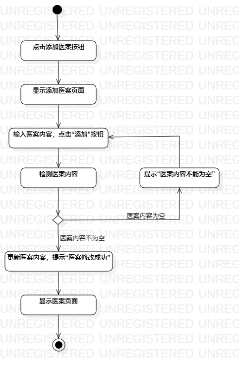
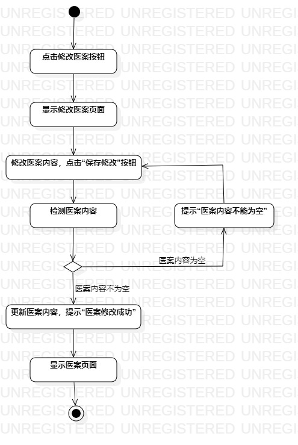

# 实验三：过程建模

## 1. 实验目标

- 掌握过程建模方法；
- 掌握活动图的画法。（Activity Diagram）

## 2. 实验内容

- 学习活动图的概念和组成
- 根据lab2中编写的用例规约画活动图

## 3. 实验步骤

- 学习教学视频
- 画活动图
- 编写实验报告

## 4. 实验结果
  
  
图1：录入医案活动图

  
  
图2：修改医案活动图
