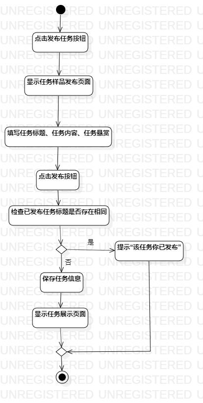
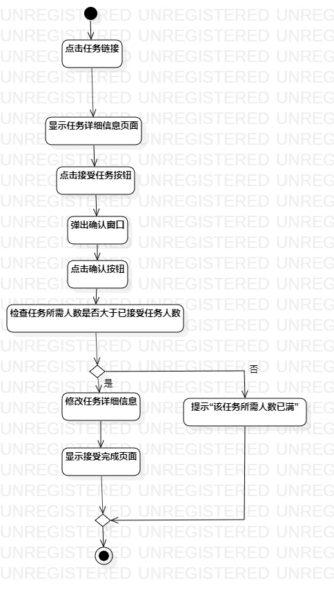

# 实验三：过程建模

## 一、实验目标

1.掌握过程建模方法；  
2.掌握活动图的画法。（Activity Diagram）

## 二、实验内容

1.创建活动图  
2.编写实验报告文档

## 三、实验步骤

1.选题为任务系统  
2.根据issue确认用例规约的步骤  
3.根据用例规约创建活动图（Lab3_ActivityDiagram、Lab3_ActivityDiagram1）  
4.建立Action的流程  

## 四、实验结果

1.发布任务活动图

  
图1.发布者发布任务

2.接受任务活动图

  
图2.接受者接受任务
