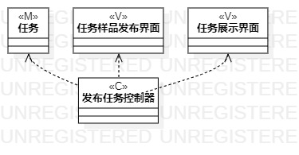
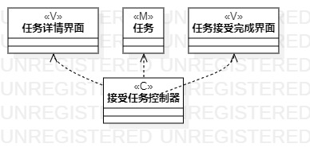

# 实验四：类建模

## 一、实验目标

1.掌握类建模方法；  
2.了解MVC或熟悉的设计模式；  
3.掌握类图的画法。（Class Diagram）

## 二、实验内容

1.基于MVC模式设计类；  
2.设计类的关系；  
3.画出类图；

## 三、实验步骤

1.回到实验二观察并分析用例规划  
2.提炼出实体类、界面类、控制类  
3.在StarUML画出各个类
4.建立各个类之间的关系，完成类建模（Lab4_ClassDiagram、Lab4_ClassDiagram1）

## 四、实验结果

1.发布任务类图

  
图1.发布者发布任务

2.接受任务类图

  
图2.接受者接受任务
