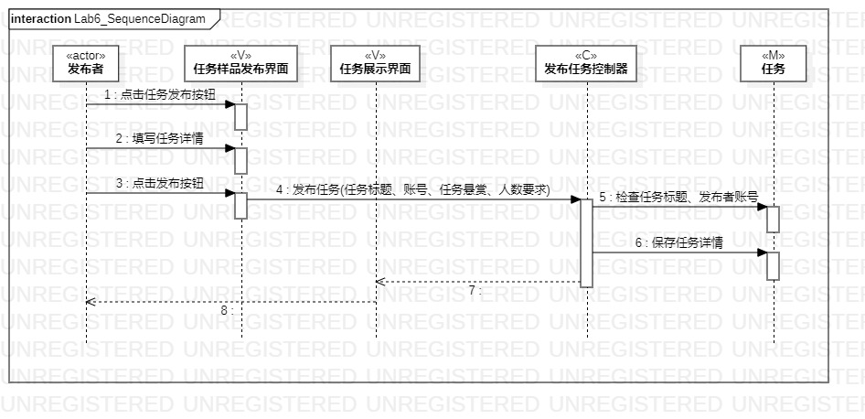
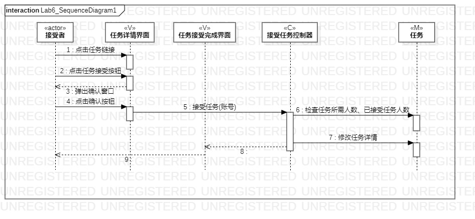

# 实验六：交互建模

## 一、实验目标

1.理解系统交互；  
2.掌握UML顺序图的画法；  
3.掌握对象交互的定义与建模方法。

## 二、实验内容

1.根据用例模型和类模型，确定功能所涉及的系统对象；  
2.在顺序图上画出参与者（对象）；  
3.在顺序图上画出消息（交互）；

## 三、实验步骤

1.分析用例规划提炼出参与者  
2.分析类图提炼出其他参与者  
3.在StarUML画出各个参与者
4.分析活动图，找出各参与者之间的消息  
5.建立各个参与者之间的消息关系（Lab6_SequenceDiagram、Lab6_SequenceDiagram1）

## 四、实验结果

1.发布任务顺序图

  
图1.发布者发布任务

2.接受任务顺序图

  
图2.接受者接受任务
