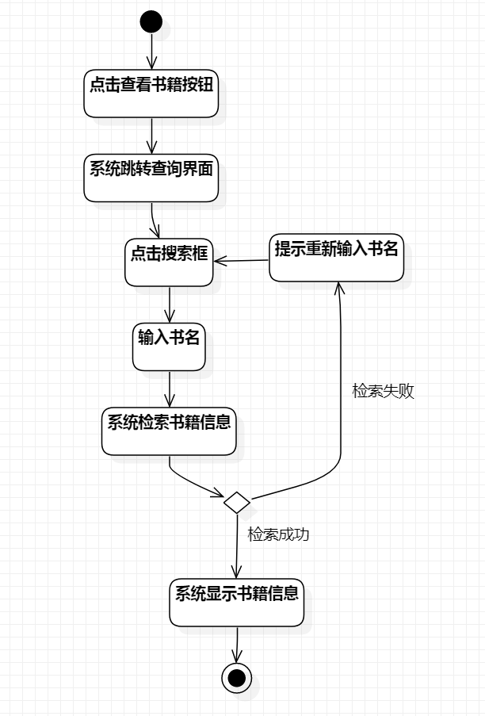
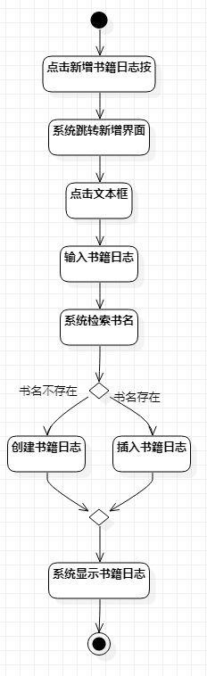

# 实验三：过程建模

## 一、实验目标

- 理解过程建模
- 掌握过程建模的画法  

## 二、实验内容

- 依据用例规约画出对应的过程活动图 

## 三、实验步骤

- 用黑点和黑点圆环表示开头与结尾  
- 依据用例规约流程和扩展流程添加过程
- 使用“流”的方式把各个过程连接起来  
- 修改用例规约内容，完善过程建模图  
- 使用StartUML自动排版，整理活动图

## 四、实验结果

    
图1.查看书籍信息的活动图  
    
图2.添加新的书籍信息的活动图  
