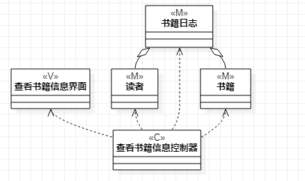
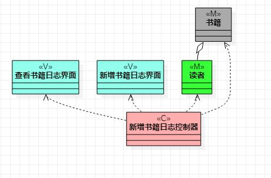

# 实验四\五:类建模\高级类建模

## 一、实验目标

1. 掌握类的概念及类建模方法
2. 了解5种关系（依赖、关联、聚合、组合和继承）
3. 掌握类之间关系的画法

## 二、实验内容

1. 以类建模的方法绘制类图
2. 根据规约绘制相应的类图
  - 添加查看书籍信息类图
  - 添加添加新的书籍信息类图

## 三、实验步骤

1. 在规约中找出model、view 和 controller 
2. 根据MVC设计模式确定类的关系
3. 在StarUML中创建类图
  - 添加查看书籍信息类图
  - 添加添加新的书籍信息类图

## 四、实验结果

图1 查看书籍信息类图

图2 添加新的书籍信息类图 

