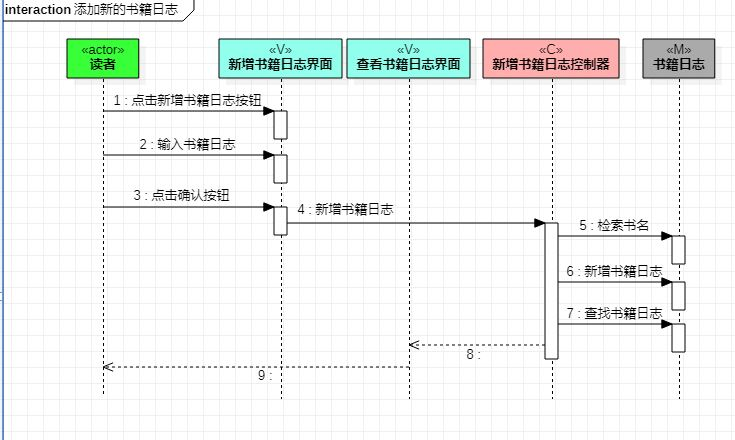
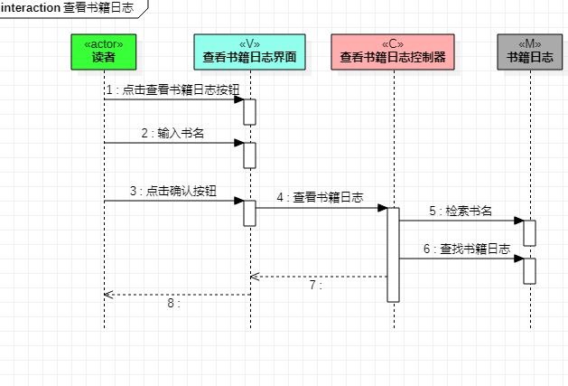

# 实验六：交互建模

## 一、实验目标

* 掌握 UML 顺序图的画法
* 掌握对象交互的定义与建模方法

## 二、实验内容

* 用例规约、活动图和类图，确定功能所涉及的系统对象
* 画出对象和消息

## 三、实验步骤

1. 从用例图中找到第一个参与者（Actor）
2. 从类图找到 N 个参与者，总共有 1+N 个参与者
3. 从活动图找到操作步骤，画出参与者之间的消息（message）
4. 在分析之后修改了实验二、三、四、五的内容和 UML 图，完善了顺序图
5. 提交图片到 github 上
6. 撰写实验报告

## 四、实验结果

  
图 1 ：新增书籍日志顺序图

  
图 2 ：查看书籍日志顺序图
