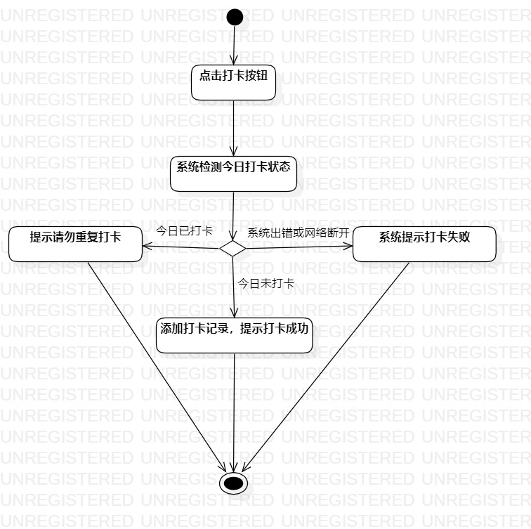
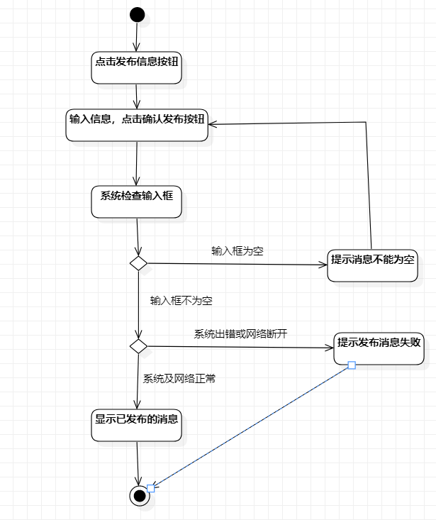

# 实验三：过程建模
## 1.实验目标

掌握过程建模的方法

掌握活动图的画法

## 2.实验内容

画出活动图

编写实验报告

## 3.实验步骤
-打开实验2的用例规约

-在StarUML上创建打卡活动图

（1）创建起始节点和结束节点

（2）根据打卡用例规约，添加活动和决策点

（3）建立各个节点、决策点和活动的关系

（4）调节，将图片变得美观

-在StarUML上创建发布消息活动图

（1）创建起始节点和结束节点

（2）根据发布消息用例规约，添加活动和决策点

（3）建立各个节点、决策点和活动的关系

（4）调节，将图片变得美观

-编写实验报告

## 4.实验结果

图1：打卡的活动图

图2：发布消息的活动图
