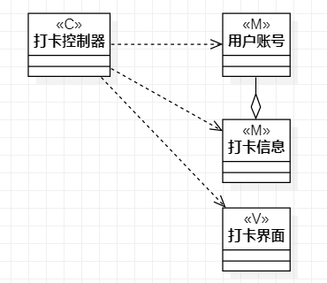
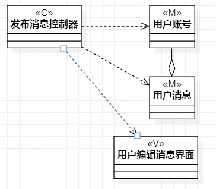

# 实验四五：类建模
## 一、实验目标

1.掌握类建模的方法

2.了解MVC设计模式

3.掌握类图的画法（Class.Diagram）

## 二、实验内容

1.基于MVC模式设计类

2.设计类的关系

3.画出类图

## 三、实验步骤

1.画出类图

2.根据用例规约添加多个Class

3.为每个类添加名字和模型

## 四、实验结果

图1：打卡的类图

图2：发布消息的类图
