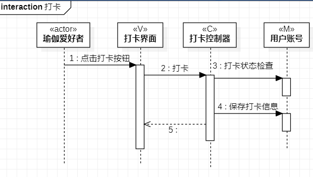

# 实验六 交互建模

## 一、实验目标

1.理解系统交互；

2.掌握UML顺序图的画法；

3.掌握对象交互的定义与建模方法。

## 二、实验内容

1.根据用例模型和类模型，确定功能所涉及的系统对象；

2.在顺序图上画出参与者（对象）；

3.在顺序图上画出消息（交互）。

## 三、实验步骤

1.打开之前实验的用例规约、活动图、类图

2.找出系统的参与者

3.把参与者与类图中的类画到顺序图中

4.找出它们之间的关系、画出消息（交互）

5.修改用例规约、活动图

## 四、实验结果

图1：打卡的顺序图

图1：发布消息的顺序图
