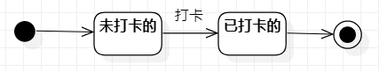
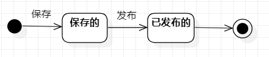

# 实验七 状态建模

## 一、实验目标

1.掌握对象状态建模（状态图，Statechart）。

## 二、实验内容

1.根据用例图、用例规约、活动图、类图、顺序图，找出项目功能会存在的状态

2.根据会存在的状态按状态顺序画出状态图

## 三、实验步骤

1.打开用例图、用例规约、活动图、类图、顺序图

2.找出项目功能会存在的状态

3.按功能分别根据会存在的状态按状态顺序画出相应的功能状态图

## 四、实验结果

图1：打卡的状态图

图1：发布消息的状态图
