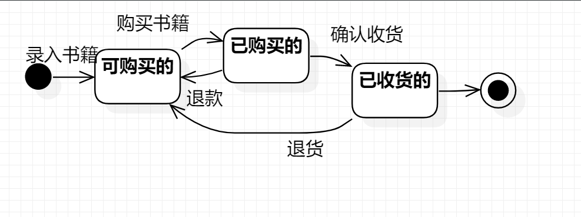

# 实验七 状态建模

## 实验目标

1.掌握对象状态建模（状态图，Statechart）。

## 实验内容

1.根据之前的模型，画出状态图

## 实验步骤

1.观看老师上传的视频

2.在自己的实验中寻找出了一个角色：角色

3.找到角色的状态：未标注的、已标注的

4.找到角色转变状态的条件：标注

5.画出状态图

## 实验要点

1.寻找一个关键的对象；

2.设计该对象的关键状态；

3.对象的状态是：对象所表示的数据。如果数据发生变化，状态就是发生变化。

描述状态：形容词。

4.设计状态之间的转变条件。

## 上课笔记内容

对象的状态：

1.找关键对象进行建模

2.对象的状态取决于对象所包含的数据

状态图画图的步骤：

1.寻找一个关键的对象，选择所建模系统中最重要的对象

2.寻找这个对象的所有重要状态

（状态命名：形容词）&（合并相同的状态）

3.画出状态之间的转变条件

## 实验结果

