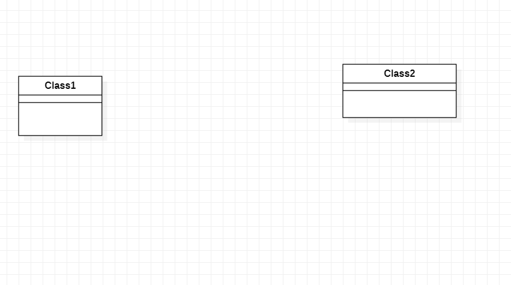

# 实验一

## 一、实验目标
1. 熟悉GitHub环境
2. 熟悉StarUML的使用

## 二、实验内容
1. 安装StarUML并创建一个图
2. 安装Git并提交文件
3. 发送请求

## 三、实验步骤
1. 下载并安装Git和StarUML
2. 去课程库fork项目到个人仓库
3. 将项目克隆到本地磁盘
4. 用StarUML创建UML图
5. 用Git上传UML图
6. 在GitHub上创建.md实验文档
7. 编写实验文档
8. 提交实验文档
9. 使用git pull更新本地的副本
10. 在git上pull request

## 四、实验结果

图1：创建的第一张UML图
