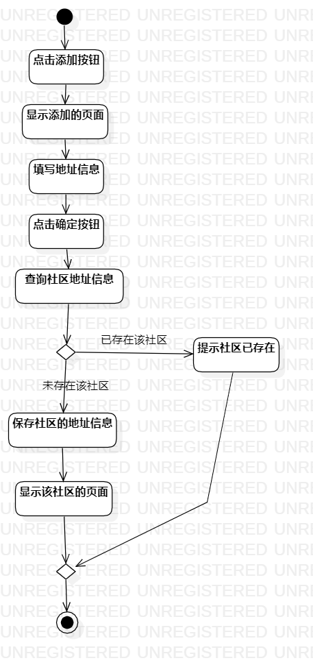
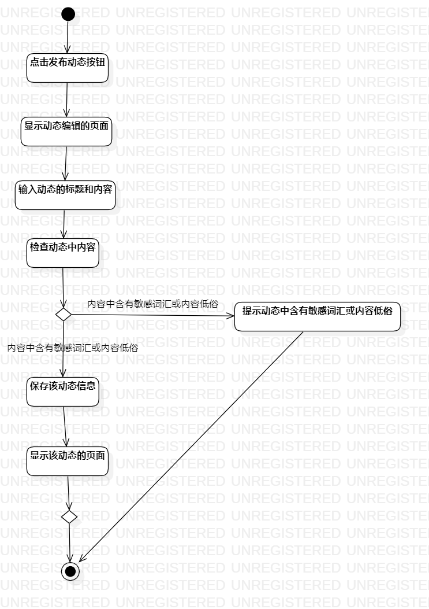

# 实验三：过程建模

## 一.实验目标

1. 学习过程建模的概念
2. 学会绘制活动图

## 二.实验内容

根据上一次实验2中的用例规约绘制活动图

## 三.实验步骤

1. 熟悉绘制活动图所需要的符号
2. 在StarUML创建两个Activity Diagram
3. 创建开始和结束的节点(Initial和Final)
4. 根据用例规约添加操作(Action)和Merge
5. 分析Merge的分流情况
6. 标注说明分流情况的条件
7. 连线
8. 完成活动图

## 四.实验结果

图1：添加社区的活动图

图2：发布动态的活动图
