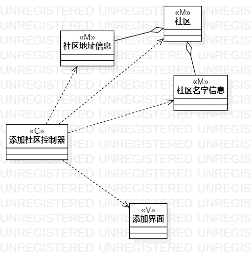
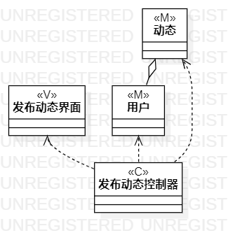

 # 实验四、五    类建模、高级类建模 
  
   ## 一、实验目标 
  
  ### 1.掌握类建模基础概念； 
  ### 2.掌握MVC架构的概念； 
  ### 3.认识类图的符号。 
  
   ## 二、实验内容 
  
  ### 1. 了解MVC的概念
  ### 2. 绘制类图
  
   
   ## 三、实验步骤 
  
  ### 1. 根据用例规约找出模型类M
  ### 2. 找出模型类中的数据间关系
  ### 3. 根据用例规约找出控制类C
  ### 4. 根据用例规约找出视图类V
  ### 5. 根据MVC的关系连线
  
   ## 四、实验结果 
  
    
  
   图1：添加社区类图
  
    
  
   图2：发布动态类图
  
 
