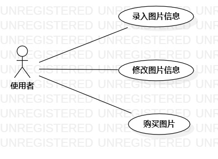

# 实验二：用例建模

## 1. 实验目标

- 创建并完善选题
- 学习使用StarUML用例建模

## 2. 实验内容

- 细化功能需求
- 使用StarUML工具画出用例图
- 编写用例规约

## 3. 实验步骤

1. 选题为图片销售系统
2. 修改选题内容
3. 确定系统的参与者:  
      - 使用者   
4. 确定用例（UserCase）:   
      - 录入图片信息
      - 修改图片信息
      - 购买图片
5. 画出用例图
6. 编写用例规约

## 4. 实验结果

图1：图片销售系统的用例图

## 表1：录入图片信息用例规约  

用例编号  | UC01 | 备注  
-|:-|-  
用例名称  | 录入图片信息  |   
前置条件  | 使用者登录进入图片销售系统 | *可选*   
后置条件  |      | *可选*   
基本流程  | 1.使用者点击录入图片信息按钮； |*用例执行成功的步骤*    
~| 2. 系统显示图片信息录入页面； |   
~| 3. 使用者上传图片，填写有关信息，点击确认按钮； |   
~| 4. 系统查询图片信息，检查未存在相同的图片信息，保存图片信息； |   
~| 5. 系统显示图片信息页面。|  
扩展流程  | 4.1 系统检查发现图片信息已存在，提示“该图片已存在”。  |*用例执行失败*    

## 表2：修改图片信息用例规约  

用例编号  | UC02 | 备注  
-|:-|-  
用例名称  | 修改图片信息  |   
前置条件  | 使用者登录进入图片销售系统  | *可选*   
后置条件  |      | *可选*   
基本流程  | 1.使用者点击需要更改信息的图片；   |*用例执行成功的步骤*    
~| 2. 系统显示图片信息修改页面； |   
~| 3. 使用者修改图片信息，点击确认按钮； |   
~| 4. 系统保存修改的内容，并显示图片信息页面。 | 
扩展流程  | 3.1 系统检查发现改动前后的信息一致，提示“此次操作无改动” |*用例执行失败*    

## 表3：购买图片用例规约  

用例编号  | UC03 | 备注  
-|:-|-  
用例名称  | 购买图片  |   
前置条件  |  使用者登录进入图片销售系统   | *可选*   
后置条件  |      | *可选*   
基本流程  | 1.使用者点击购买的图片；   |*用例执行成功的步骤*    
~| 2. 系统显示图片信息页面； |   
~| 3. 使用者点击购买按钮； |   
~| 4. 系统显示订单信息页面并提示使用者支付；|   
~| 5. 完成订单支付，系统记录订单信息，并显示“支付成功”。|  
扩展流程  | 4.1 使用者未支付成功，系统提示“支付失败，请重新操作”。  |*用例执行失败*  
