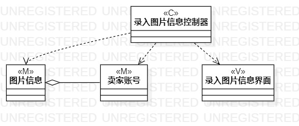
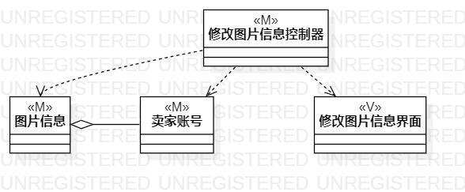
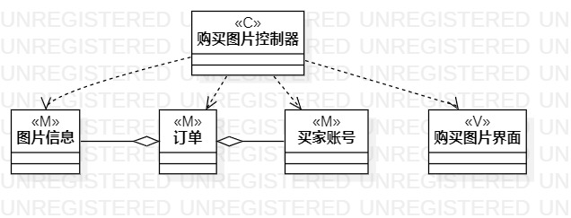

# 实验四：类建模
# 实验五：高级类建模

## 一. 实验目标

- 掌握类的概念和构成
- 掌握类建模方法
- 了解MVC设计模式
- 理解类的五种关系
- 掌握类之间关系的画法

## 二. 实验内容

- 观看老师的视频学习本次实验内容
- 学习关于类的知识和MVC设计模式
- 找出自己每个用例中的类
- 画出类图
- 编写实验报告

## 三. 实验步骤

#### 1. 观看教学视频学习实验内容

#### 2. 根据MVC设计模式和自己的用例确定具体的类

2.1 录入图片信息：
- Model：图片信息、使用者账号；
- View：录入图片信息界面；
- Controller：录入图片信息控制器。

2.2 修改图片信息：
- Model：图片信息；
- View：修改图片信息界面；
- Controller：修改图片信息控制器。

2.3 购买图片：
- Model：图片信息、使用者账号、订单；
- View：购买图片界面；
- Controller：购买图片界面。

#### 3. 根据具体的类画出相应的类图

3.1 根据已确定的类创建类图

3.2 根据类的类型，给类标注M/V/C

3.3 根据类之间类型的关系，选择对应的线进行连接

3.4 保存并导出JEPG格式图

#### 4. 编写实验报告

## 四. 实验结果

图1：录入图片信息的类图

图2：修改图片信息的类图

图3：购买图片的类图