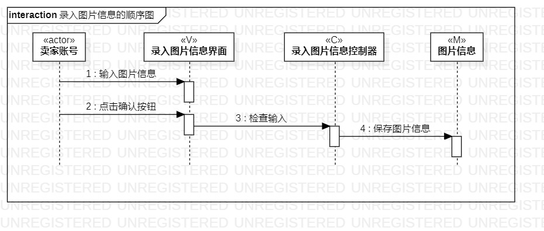
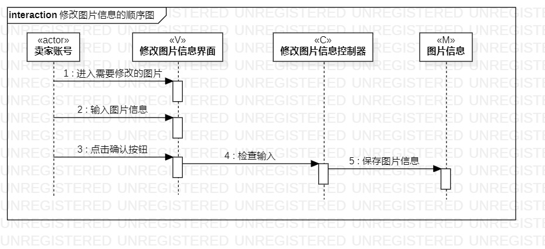
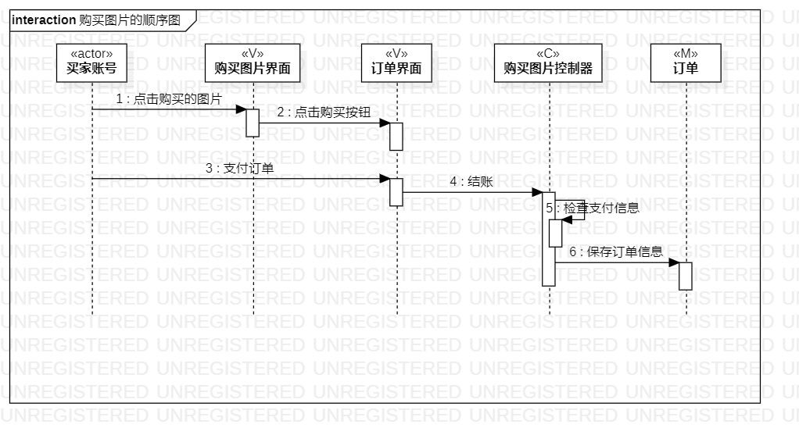

# 实验六：交互建模

## 一. 实验目标

- 理解系统交互
- 掌握UML顺序图的画法
- 掌握对象交互的定义与建模方法

## 二. 实验内容

- 观看老师的视频学习本次实验内容
- 根据用例模型和类模型，确定功能所涉及的系统对象
1. 录入图片信息顺序图
2. 修改图片信息顺序图
3. 购买图片顺序图
- 在顺序图上画出参与者（actor）
- 在顺序图上画出信息（交互）
- 在顺序图上画出时间条
- 编写实验报告

## 三. 实验步骤

#### 1. 观看教学视频学习实验内容

#### 2. 根据实验二、三确定三张顺序图

2.1 录入图片信息的顺序图

2.2 修改图片信息的顺序图

2.3 购买图片的顺序图

#### 3. 根据实验四、五确定顺序图中的参与者actor、界面view、控制器control、类model

#### 4. 根据实验三创建时间条与信息，使用连线连接起来

#### 5. 编写实验报告

## 四. 实验结果

图1：录入图片信息的顺序图

图2：修改图片信息的顺序图

图3：购买图片的顺序图
