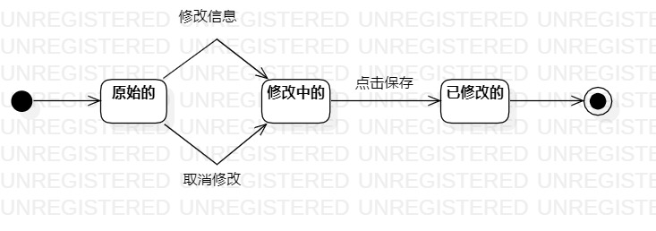

# 实验七：状态建模

## 一. 实验目标

- 掌握对象状态建模（状态图，Statechart）

## 二. 实验内容

- 观看老师的视频学习本次实验内容
- 根据自己的系统寻找对象画出状态图
- 编写实验报告

## 三. 实验步骤

#### 1. 观看教学视频学习实验内容

#### 2. 根据自己的系统找到对象

#### 3. 画出该对象的状态图

#### 4. 编写实验报告

## 四. 实验结果

图1：图片信息的状态图
