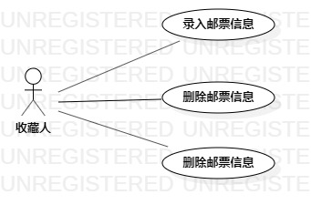

# 实验二：用例建模

## 一、实验目标

1. 选题并用例建模  
2. 了解并掌握用例图画法  
3. 了解并掌握用例规约  

## 二、实验内容

1. UML建模选题  
2. 画建模用例图  
3. 编写用例规约  

## 三、实验步骤

1. 选题确定：邮票收藏管理软件  
2. 确定用户：收藏人 
3. 确定功能：  
（1）录入邮票信息：收藏人可以记录邮票的信息  
（2）删除邮票信息：收藏人可以删除软件中已有的邮票信息  
（3）修改邮票信息：收藏人可以修改软件中已有的邮票信息  
4. 确定功能与用户之间的联系  
5. 编写用例规约  

## 四、实验结果
1. 用例图  

  

图1. 邮票收藏管理软件的用例图  

 ## 表1：录入用例1规约  

 用例编号  | UC01 | 备注  
-|:-|-  
用例名称  | 录入邮票信息  |   
前置条件  |      | *可选*   
后置条件  |      | *可选*   
基本流程  | 1. 收藏人点击新添信息按钮；  |*用例执行成功的步骤*    
~| 2. 系统显示邮票信息录入界面；  |   
~| 3. 收藏人输入邮票信息，点击保存按钮；  |   
~| 4. 系统查询邮票信息，检查未存在相同邮票信息，保存邮票信息；  |   
~| 5. 系统显示邮票信息界面。  |  
扩展流程  | 2.1 系统检查邮票信息已存在，提示收藏人“该邮票信息已存在”。  |*用例执行失败*    
 

 ## 表2：删除用例2规约  

 用例编号  | UC02 | 备注  
-|:-|-  
用例名称  | 删除邮票信息  |   
前置条件  |      | *可选*   
后置条件  |      | *可选*   
基本流程  | 1. 收藏人点击删除按钮；  |*用例执行成功的步骤*    
~| 2. 系统显示删除界面；  |   
~| 3. 收藏人输入邮票信息，点击确认按钮；  |   
~| 4. 系统查询邮票信息，检查邮票信息存在，删除该邮票信息；  |   
~| 5. 系统提示“删除成功”。  |  
扩展流程  | 2.1 系统查询不到邮票信息，系统提示“该邮票不存在，删除失败”。   |*用例执行失败*    

 ## 表3：修改用例3规约  

 用例编号  | UC03 | 备注  
-|:-|-  
用例名称  | 修改邮票信息  |   
前置条件  |      | *可选*   
后置条件  |      | *可选*   
基本流程  | 1. 收藏人选择需要修改的邮票，点击修改按钮；  |*用例执行成功的步骤*    
~| 2. 系统显示修改界面；  |   
~| 3. 收藏人输入邮票信息，点击确认按钮； |   
~| 4. 系统查询邮票信息，检查未存在相同邮票信息，系统提示“修改成功”；  |   
扩展流程  | 2.1 系统检查邮票信息已存在，提示“修改失败”；   |*用例执行失败*    

