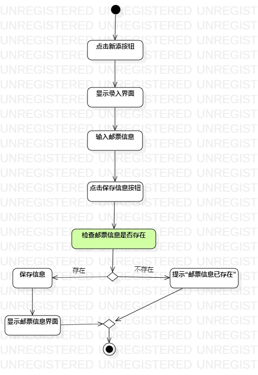
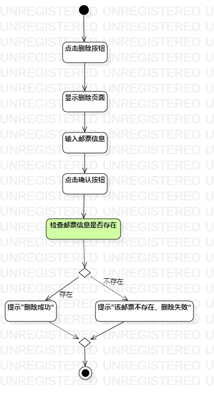
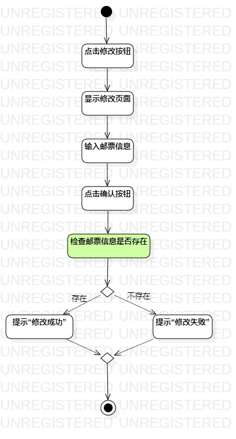

# 实验三：过程建模

## 一、实验目标

1. 掌握过程建模方法；
2. 掌握活动图的画法。（Activity Diagram）    

## 二、实验内容

1. 学习活动图画法；  
2. 根据用例规约用StarUML画活动图。    

## 三、实验步骤

1. 使用StarUML新建Activity Diagram；  
2. 使用Initial、Final、Action、Decision、Merge、Control Flow元素绘图；
3. 根据用例规约确定Action； 
4. 确定决策路径发生的条件。 

## 四、实验结果
图1：录入的活动图 

图2：删除的活动图

图3：修改的活动图

