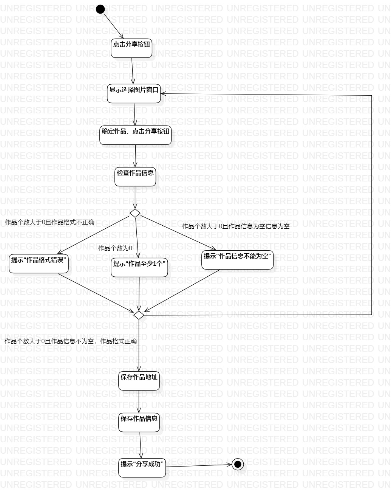
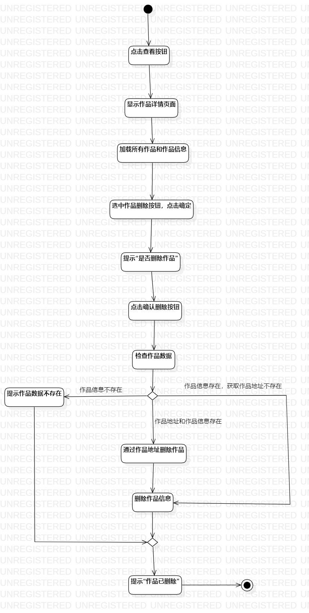

# 实验三：过程建模

## 一、实验目标

1. 掌握过程建模方法；
2. 掌握活动图的画法。

## 二、实验内容

1. 观看视频学习活动图的绘画；
2. 根据实验二完成的用例规约绘画活动图；
3. 修改用例规约和活动图；
4. 编写实验报告。

## 三、实验步骤

1. 理解活动图的符号意义及其用法；
2. 在StarUML创建Activity Diagram；
3. 添加Initial；
4. 根据用例规约添加Action和Decision；
5. 思考用例规约的严谨性，修改用例规约和活动图；
6. 添加Final；
7. 最后用Control Flow将各符号连接；
8. 再次检查用例规约和活动图的严谨性；
9. 使用Git Bash提交实验报告。

## 四、实验结果

### 分享作品的活动图

### 删除已分享作品的活动图

