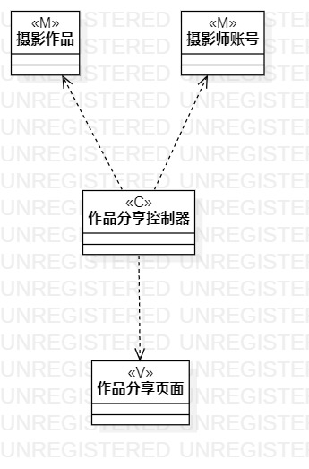
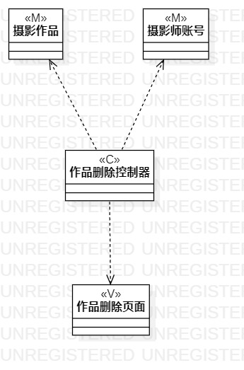

# 实验四五：类建模

## 一、实验目标

1. 掌握类建模；
2. 了解MVC或你熟悉的设计模式；
3. 掌握类图的画法(Class Diagram)。

## 二、实验内容

1. 观看老师发布的视频，了解MVC设计模式，学习类建模；
2. 根据自己的用例，找出类，根据MVC设计模式进行类建模。

## 三、实验步骤

1. 理解类图的符号意义及其用法；
2. 在StarUML创建Class Diagram；
3. 添加Class；
4. 根据用例规约设置好Class的name和stereotype；
5. 用依赖线和聚合线把Class建立起联系；
6. 思考类图的严谨性，修改用例规约和类图；
7. 利用Github根据将画好的类图上传；
8. 撰写实验报告。

## 四、实验结果

### 分享作品的类图

### 删除已分享作品的类图

