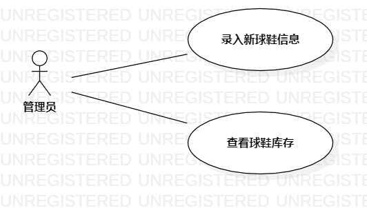

# 实验二：用例建模

## 一、实验目标

1. 确定并完善选题
2. 学会用例建模
3. 掌握Markdown的基本语法

## 二、实验内容

1. 用例建模
2. 学习Markdown基本语法编写报告

## 三、实验步骤

1. 选题并创建Issue，Issue名为：球鞋交易系统
2. 确定Use case
   - 录入新球鞋信息
   - 查看球鞋库存
3. 确定actor
   - 管理员
4. 确定Use case与actor之间的关系
5. 使用StarUML完成用例建模
6. 编写实验报告

## 四、实验结果

### 4.1用例图

图1：球鞋交易系统的用例图

### 4.2用例规约

#### 表1：录入新球鞋信息用例规约

| 用例编号 | UC01                                                         | 备注                   |
| -------- | ------------------------------------------------------------ | ---------------------- |
| 用例名称 | 录入新球鞋信息                                                 |                        |
| 前置条件 | 管理员登录到后台系统                                         |                        |
| 后置条件 | 新球鞋页面生成                                               |                        |
| 基本流程 | 1. 管理员进入新球鞋录入页面；                              | 成功                   |
| ~        | 2. 录入球鞋名称、尺码、图片；                                 | 分类：篮球鞋、板鞋 |
| ~        | 3. 管理员点击录入按钮；                                  |                        |
| ~        | 4. 系统检查录入分类信息（名称、尺码）格式正确且不为空、图片个数大于零、和图片格式正确； |                        |
| ~        | 5. 系统保存图片并获取图片地址，保存图片信息，提示“发布成功”。|                      |
| 扩展流程 | 4.1 系统检查分类信息为空，提示“图片分类信息不为空”；     | 失败                   |
| ~        | 4.2 检查球鞋信息格式错误，提示“格式错误”            | 失败                   |
| ~        | 4.3 系统检查图片个数大于零和图片格式不正确，提示“图片格式错误”。 | 失败                   |

#### 表2：查看球鞋库存用例规约

| 用例编号 | UC02                                                         | 备注     |
| -------- | ------------------------------------------------------------ | -------- |
| 用例名称 | 查看球鞋库存                                                 |          |
| 前置条件 | 管理员登录到库存系统                                         |          |
| 后置条件 |                                                              |          |
| 基本流程 | 1. 管理员点击查看库存；                                  | 成功     |
| ~        | 2. 管理员输入球鞋品类；                                | 名称 |
| ~        | 3. 系统检查输入球鞋品类格式正确，尺码不为空；                                   |          |
| ~        | 4. 页面显示当前球鞋库存；                                   |          |
| 扩展流程 | 2.1 输入球鞋品类不存在；提示“请输入正确的品类”                    | 失败     |
| ~        | 2.2 品类格式不正确； 提示“请输入正确的格式”                          | 失败     |

