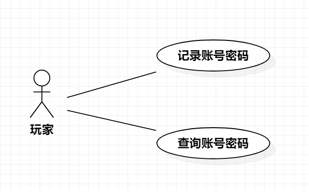

# 实验二：用例建模

## 1.实验目标

- 理解UML概念
- 理解用例概念
- 学会画用例图

## 2.实验内容

- 细化功能需求
- 绘制用例图
- 编写用例规约

## 3.实验步骤

- 绘制用例图
- 添加用户（玩家）和两个用例（记录账号密码、查找账号密码）
- 编写用例规约

## 4.实验结果

- 表1：记录账号密码

用例编号  | UC01 | 备注  
-|:-|-  
用例名称  | 记录账号密码  |   
前置条件  |     | *可选*   
后置条件  |      | *可选*   
基本流程  | 1.玩家选择一个游戏所属的游戏平台；  |*用例执行成功的步骤*    
~| 2.点击新增，系统跳转该游戏平台账号密码新增页面；  |   
~| 3.玩家输入欲保存的账号密码，点击保存；  |   
~| 4.系统检索该平台下账号信息，检测未存在该账号，保存账号密码；  |   
~| 5.系统显示保存成功信息页面。  |  
扩展流程  | 4.1系统检索该平台下账号信息，检测已存在该账号，提示玩家“该账号已存在，添加失败！”。 |*用例执行失败* 

- 表2：查询账号密码

用例编号  | UC02 | 备注  
-|:-|-  
用例名称  | 查询账号密码  |   
前置条件  |     | *可选*   
后置条件  |      | *可选*   
基本流程  | 1.玩家选择一个游戏所属的游戏平台；  |*用例执行成功的步骤*    
~| 2.点击查询，系统跳转该游戏平台账号密码查询页面；  |   
~| 3.系统检索该平台下账号信息，检测到有相关账号，显示该游戏平台下已保存的所有账号密码；  |   
扩展流程  | 3.1系统检索该平台下账号信息，检测到无任何账号，提示玩家“该平台下还未保存过任何账号密码！”  |*用例执行失败* 

  
图1 用例图
