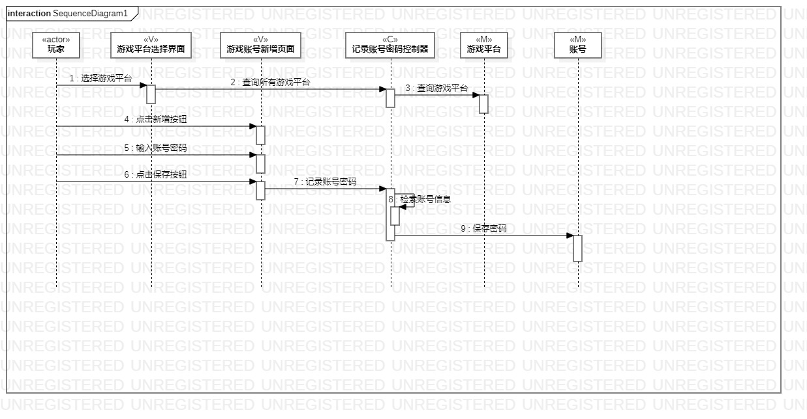
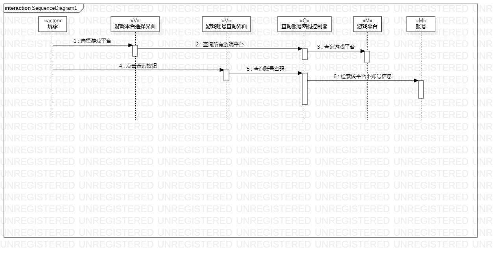

# 实验六：交互建模
## 1.实验目标

- 理解系统交互
- 掌握UML顺序图的画法
- 掌握对象交互的定义与建模方法

## 2.实验内容

- 根据用例规约及类图画顺序图
- 完成实验报告

## 3.实验步骤

- 掌握UML顺序图的画法
- 根据用例规约及类图画出相应顺序图
- 撰写实验报告

## 4.实验结果

  
图1 记录账号密码的顺序图

  
图2 查询账号密码的顺序图
