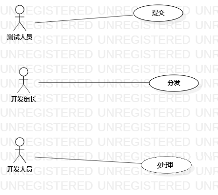

# 实验二：用例建模

## 一、实验内容

1. 细化功能需求。
2. 画出用例图（Use Case Diagram）。
3. 编写用例规约（表格）。

## 二、实验要求

1. 给每一个功能点写一段描述（字数至少60字，3行）。
2. 写清楚使用功能的用户。
3. 说明该功能执行之后产生的结果。
4. 用例规约必填：基本流程（成功执行用例的步骤）；扩展流程（引起用例失败的步骤）。

## 三、实验步骤

1. 确定Bug管理系统功能并完善描述
   - 提交：测试人员提交bug。提交的信息包括：bug类型、所处模块、严重程度、环境描述等。
   - 分发：开发组长分发bug给对应的开发人员。
   - 处理：开发人员（1人或2人）修复bug。
2. 确定使用者
   - 测试人员
   - 开发组长
   - 开发人员
3. 创建useCase（提交，分发，处理）分别与actor（测试人员，开发组长、开发人员）连线。
4. 导出用例图。

## 四、实验结果

### 用例图

  

### 用例规约的编写

1. 表1：提交用例规约

   + | 用例编号 | UC01                                            | 备注                 |
     | -------- | :---------------------------------------------- | -------------------- |
     | 用例名称 | 提交                                            |                      |
     | 前置条件 | 测试人员登录系统；                              | *可选*               |
     | 后置条件 |                                                 | *可选*               |
     | 基本流程 | 1. 测试人员点击下拉栏选择bug类型；              | *用例执行成功的步骤* |
     | ~        | 2. 系统显示bug信息表；                          |                      |
     | ~        | 3. 测试人员填写bug详细信息；                    |                      |
     | ~        | 4. 测试人员点击提交按钮；                       |                      |
     | ~        | 5. 系统检测bug是否存在；                        |                      |
     | ~        | 6. 系统显示提交情况；                           |                      |
     |          | 7. 系统保存bug报告；                            |                      |
     | 扩展流程 | 2.1 系统检测发现bug已存在， 显示“该bug已存在”； | *用例执行失败*       |

2. 表2：分发用例规约  

   + | 用例编号 | UC02                                              | 备注                 |
     | -------- | :------------------------------------------------ | -------------------- |
     | 用例名称 | 分发                                              |                      |
     | 前置条件 | 开发组长登录系统                                  | *可选*               |
     | 后置条件 |                                                   | *可选*               |
     | 基本流程 | 1. 开发组长点击按钮进入bug信息库；                | *用例执行成功的步骤* |
     | ~        | 2. 系统显示bug报告；                              |                      |
     | ~        | 3. 开发组长查看bug类型并做分析；                  |                      |
     | ~        | 4. 开发组长点击下拉栏；                           |                      |
     | ~        | 5. 系统罗列开发人员名字列表；                     |                      |
     | ~        | 6. 开发组长选择某人并点击按钮提交；               |                      |
     | ~        | 7. 系统检测bug类型是否在处理人员负责的范围内；    |                      |
     | ~        | 8. 系统显示分发情况；                             |                      |
     | ~        | 9. 系统发送该bug信息至处理人员的个人空间；        |                      |
     | ~        | 10. 系统更新bug报告；                             |                      |
     | 扩展流程 | 2.1 系统检测发现该bug不在该处理人员的负责范围内。 | *用例执行失败*       |

3. 表3：处理用例规约

   + | 用例编号 | UC03                                                        | 备注                 |
     | -------- | :---------------------------------------------------------- | -------------------- |
     | 用例名称 | 处理                                                        |                      |
     | 前置条件 | 开发人员登录系统                                            | *可选*               |
     | 后置条件 |                                                             | *可选*               |
     | 基本流程 | 1. 开发人员点击按钮进入个人空间；                           | *用例执行成功的步骤* |
     | ~        | 2. 系统显示bug报告；                                        |                      |
     | ~        | 3.  开发人员查看bug详情、找到问题模块并进行分析、修改代码； |                      |
     | ~        | 4. 开发人员点击更新按钮；                                   |                      |
     | ~        | 5. 系统发送验证信息给测试人员；                             |                      |
     | ~        | 6. 系统监听、检测测试人员的反馈；                           |                      |
     | ~        | 7.  系统显示测试人员的反馈；                                |                      |
     | ~        | 8. 系统更新bug报告；                                        |                      |
     | 扩展流程 | 2.1 系统显示仍存在bug。                                     | *用例执行失败*       |

