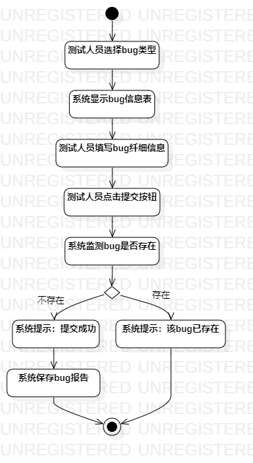
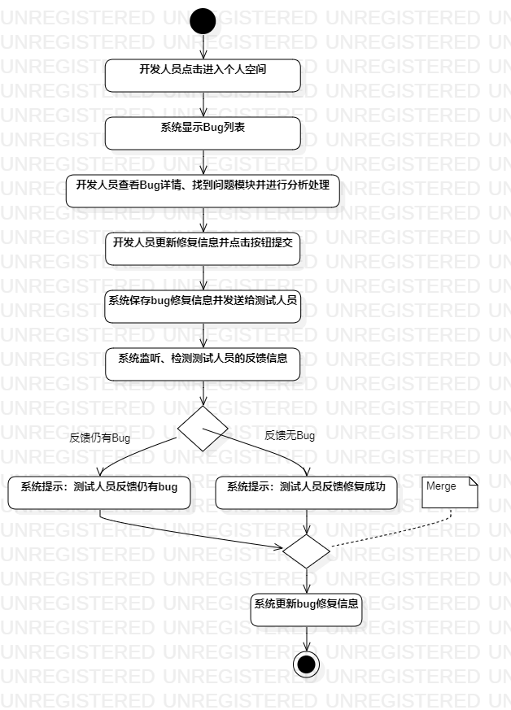

# 实验三：过程建模

## 1. 实验目标

+ 掌握过程建模方法

+ 掌握活动图的画法

## 2. 实验内容

+ 利用StarUML画出活动图

+ 熟悉活动图符号的用法和意义

+ 编写实验报告

## 3. 实验步骤

1. 观看教学视频学习StarUML。

2. 查看实验二的用例规约。

3. 根据提交Bug用例规约画出对应的活动图。

4. 根据分发Bug用例规约画出对应的活动图。

5. 根据修复Bug用例规约画出对应的活动图。

6. 编写实验报告。

## 4. 实验结果

图1：提交Bug活动图

图2：分发Bug的活动图

图3：修复Bug的活动图