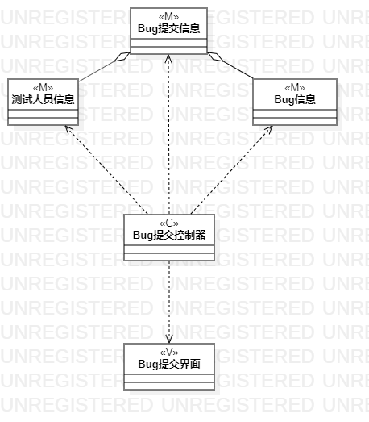
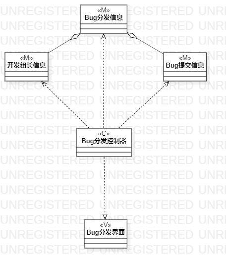
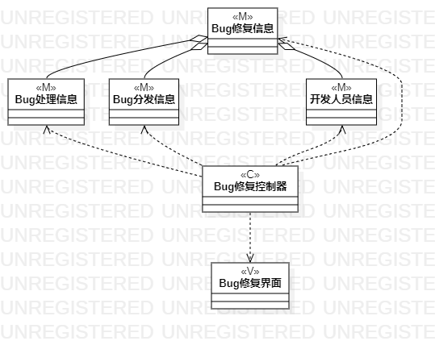

# 实验四五：类建模

## 一、实验目标

1. 掌握类建模方法  
2. 了解 MVC 或你熟悉的设计模式  
3. 掌握类图的画法  

## 二、实验内容

1. 观看教学视频熟悉类图的画法
2. 了解并熟悉 MVC 设计模式
3. 根据用例规约绘制类图

## 三、实验步骤

1. 确定设计的模式： MVC 设计模式
2. 查看用例规约，分析用例的类、控制器和界面
3. 确定类之间的关系
4. 采用 StarUML 工具绘制类图
5. 导出类图并上传到 GitHub 上
6. 撰写实验报告

## 四、实验结果

 
图 1 ：Bug提交类图

  
图 2 ：Bug分发类图

  
图 3 ：Bug修复类图